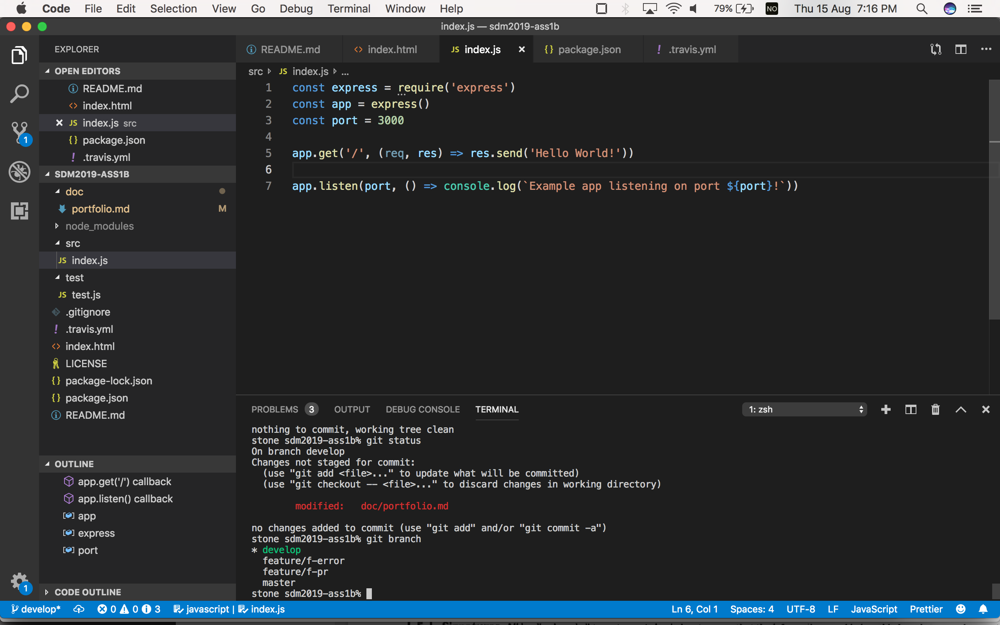
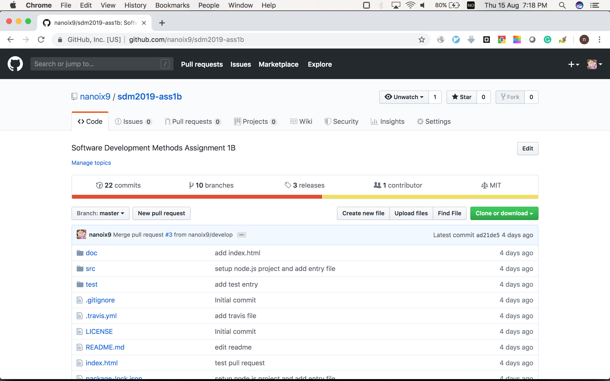
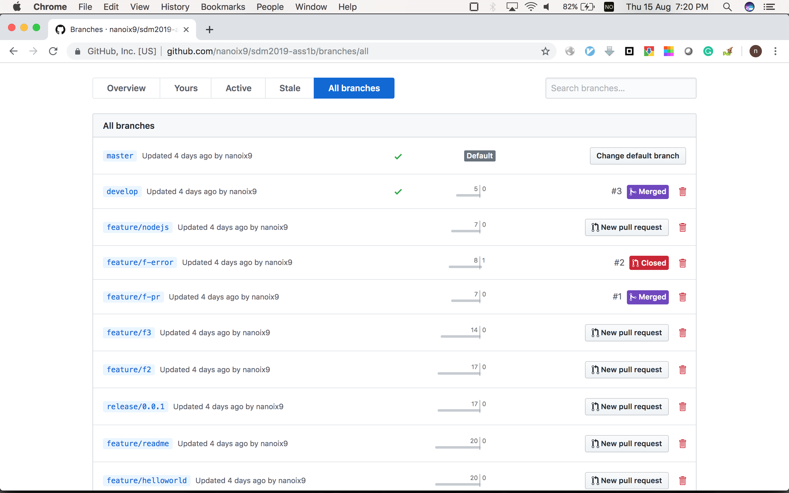
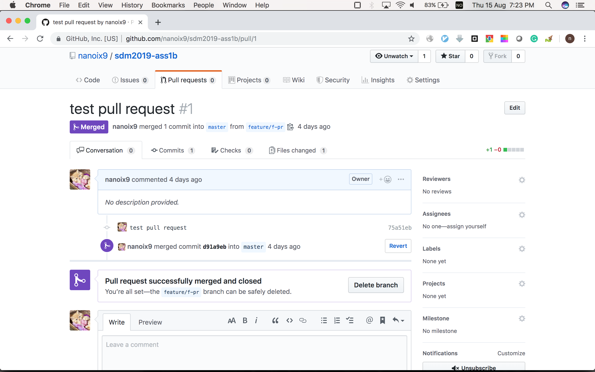
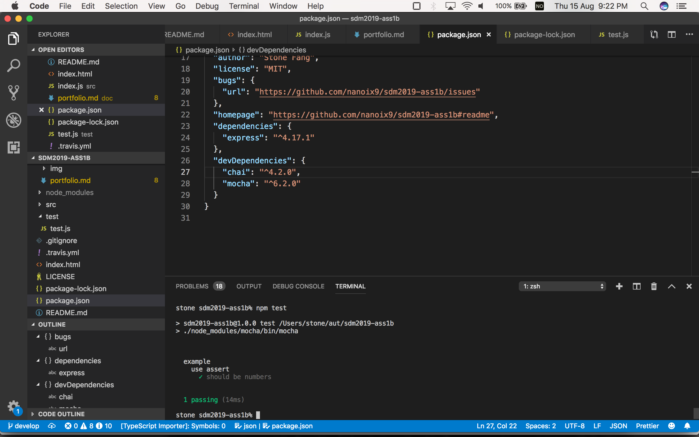

# Evidences

1. VS Code, Git repo on own machine

    screenshot: 

2. GitHub repository

    link: <https://github.com/nanoix9/sdm2019-ass1b>
    
    screenshot: 

3. Gitflow branching configuration

    link: <https://github.com/nanoix9/sdm2019-ass1b/branches/all>

    screenshot: 

4. pull request function of GitHub

    link:

    - <https://github.com/nanoix9/sdm2019-ass1b/pulls?q=is%3Apr+is%3Aclosed>
    - <https://github.com/nanoix9/sdm2019-ass1b/pull/1>

    screenshots:

    succeeded: 

    rejected: 

5. TravisCI

    link: <https://github.com/nanoix9/sdm2019-ass1b/blob/master/.travis.yml>

6. node.js, React, express.js and MongoDB

    - node.js: <https://github.com/nanoix9/sdm2019-ass1b/blob/master/package.json>
    - react: <>
    - express: <https://github.com/nanoix9/sdm2019-ass1b/blob/master/src/index.js>
    - mongodb: <>

7. Mocha and Chai

    screenshot: 
    
> 8. You have setup Heroku to deploy your production code from GitHub to the cloud.
> 9. Optional: set up Cucumber (or similar) for automated acceptance testing.
> 10. Optional: use Containers for your development and production.
> 11. Optional: use Datadog (or similar) to monitor (log) the behaviour of the application after deployment