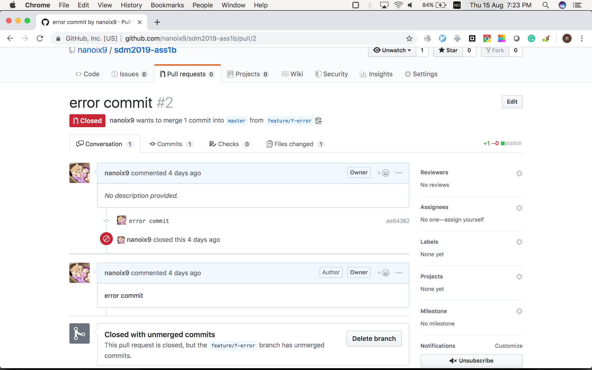

# VS Code, Git repo on own machine

screenshot of VS code and local git repo: 

# GitHub repository

link: <https://github.com/nanoix9/sdm2019-ass1b>

screenshot: 

# Gitflow branching configuration

Git flow makes use of several branch naming conventions: master, develop, feature, hotfix, release.

link: <https://github.com/nanoix9/sdm2019-ass1b/branches/all>

screenshot: 

# pull request function of GitHub

link:

- <https://github.com/nanoix9/sdm2019-ass1b/pulls?q=is%3Apr+is%3Aclosed>
- <https://github.com/nanoix9/sdm2019-ass1b/pull/1>

screenshots:

succeeded: 

rejected: 

# TravisCI

To enable TravisCI, developer should put a .travis.yml in github repo and connect travis-ci.com with github account.

link: <https://github.com/nanoix9/sdm2019-ass1b/blob/master/.travis.yml>

screenshot of one TravisCI job details:

# Node.js, React, express.js and MongoDB

create an application that show a simple table. To start the application, run `npm start`

- node.js: <https://github.com/nanoix9/sdm2019-ass1b/blob/master/package.json>
- react: <https://github.com/nanoix9/sdm2019-ass1b/blob/master/src/app/app.jsx>
- express: <https://github.com/nanoix9/sdm2019-ass1b/blob/master/src/index.js>
- mongodb: <https://github.com/nanoix9/sdm2019-ass1b/blob/master/src/server/db.js>

screenshot of source code:

web page:

# Mocha and Chai

Mocha is a unit test framework and Chai is an assertion library

command:

    npx mocha

link: <https://github.com/nanoix9/sdm2019-ass1b/blob/master/test/test.js>

screenshot: 

    
# Deployment to Heroku

Heroku is a cloud platform to host web applications

command:

    heroku create
    git push heroku develop:master

link: <https://lit-beyond-33040.herokuapp.com>

screenshot: 

# Cucumber

Cucumber is a tool to write test in natural language, which usually contains three kind of files: feature file, world file, and steps file.

command:

    npx cucumber-js

code link: <https://github.com/nanoix9/sdm2019-ass1b/tree/master/features>

screenshot: 

# Docker

Add a dockerfile first: <https://github.com/nanoix9/sdm2019-ass1b/tree/master/Dockerfile>

build docker image:

    docker build -t stone/sdm-ass1b .

run docker container:

    docker run -p 3000:3000 --rm stone/sdm-ass1b

screenshot:

